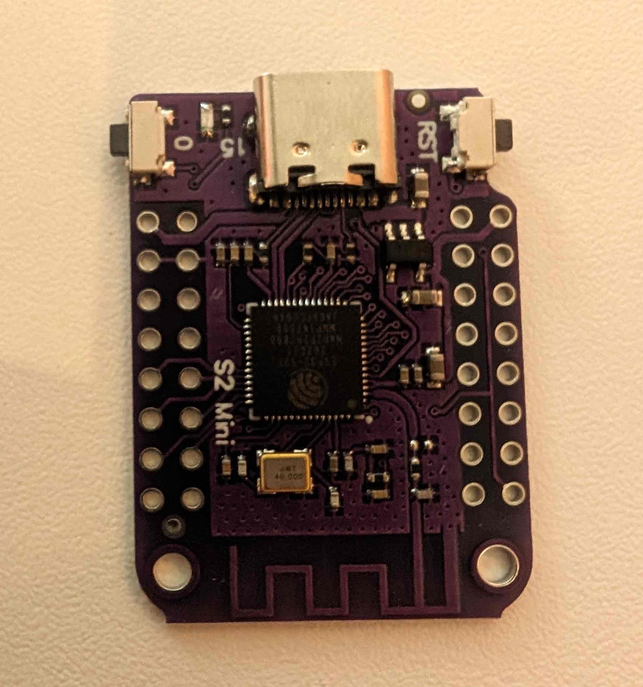
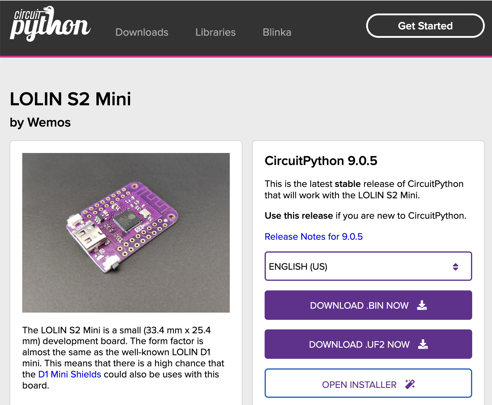
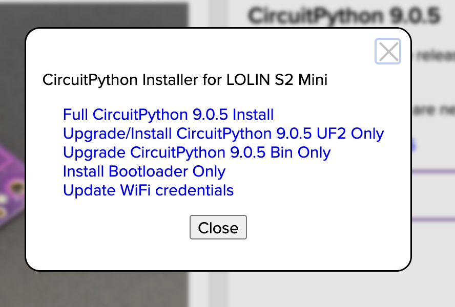
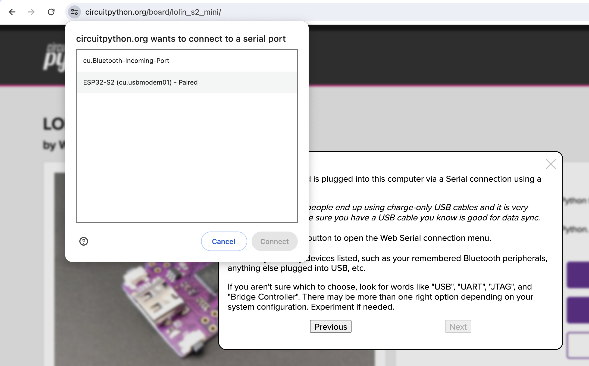
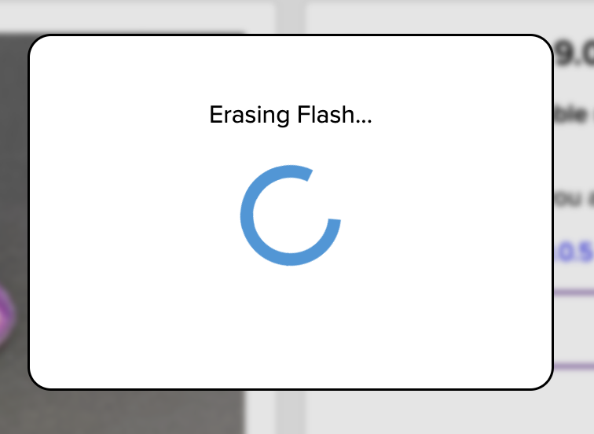
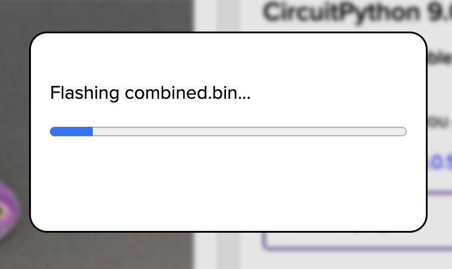
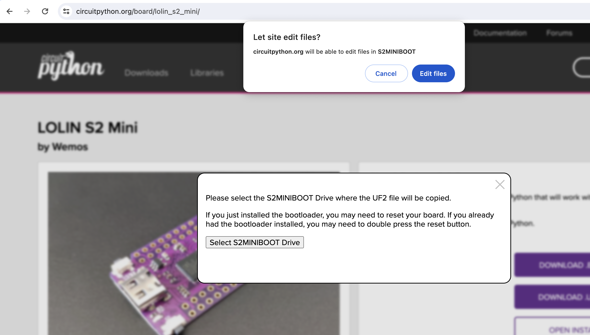

# Gifts workshop ft. CircuitPython & Val Town

## Goals
* Get CircuitPython installed on WiFi enabled microcontroller board.
* Explore/modify example CircuitPython apps
* Set up Val Town account and create a "val" (function) that can be accessed by a standard HTTPS web call
* Communicate between CircuitPython and Val Town apps

## Things You'll Need
1. LOLIN S2 Mini development board (see below)
1. Computer with Google Chrome installed
1. USB cable to connect development board and computer

## Hardware Introduction

#### LOLIN S2 Mini
An [ESP32-S2](https://www.espressif.com/en/products/socs/esp32-s2) WiFi development board

Available on [Amazon](https://www.amazon.com/s?k=s2+mini)
and (even cheaper) on [AliExpress](https://www.aliexpress.us/w/wholesale-s2-mini.html?spm=a2g0o.home.search.0).

### Features
* Reset button (labeled `RST`, top right)
    * Restarts the code running on the ESP32
* "Boot" button (labeled `0`, top-left)
    * When held while reset is pressed/released, this will put the ESP32 into bootloader mode, which allows new code to be "flashed" to it from the computer.
    * **You can use this button to perform actions in your code!** It is attached to ESP32 pin 0.
* LED (white rectangle between boot button and USB port)
    * You can turn it on off from your code. It is attached to ESP32 pin 15.
* GPIO pins (32 silver lined holes on either side)
    * Can be used to hook up external components (sensors, displays, etc)
    * We won't be using these in this workshop

## Installing CircuitPython
1. **In Google Chrome** (other browsers don't work yet), navigate to the [CircuitPython installer page for for LOLIN S2 Mini](https://circuitpython.org/board/lolin_s2_mini/)

2. Plug your S2 Mini into your computer using its USB-C port.
2. After it is plugged in, **hold the boot button (`0`) and -while holding- press and release the reset button (`RST`).** Release the boot button.
2. On the CircuitPython web page, click the `Open Installer` button.

5. Click `Full CircuitPython 9.X.X Install`
5. Click `Next` then `Connect`

7. Select your ESP32-S2 device from Chrome's drop down menu and click `Connect`.
7. When you are asked to "overwrite everything" on the device, click `Continue`.
7. Installation will begin:

10. When flashing is done, hit the reset (`RST`) button.
10. Click `Select S2MINIBOOT Drive`, and find the the drive named `S2MINIBOOT` that should now be mounted to your computer. **DO NOT SELECT ANY OTHER DRIVE - IF YOU ARE UNSURE, BAIL!**
10. If prompted, allow the site to `Edit Files`

