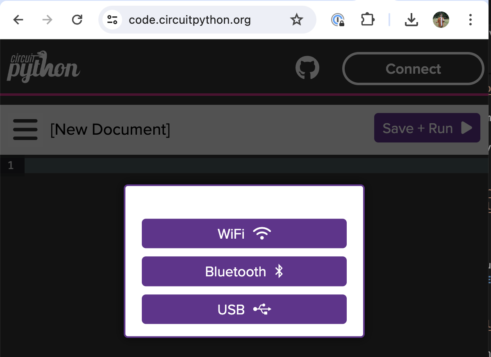
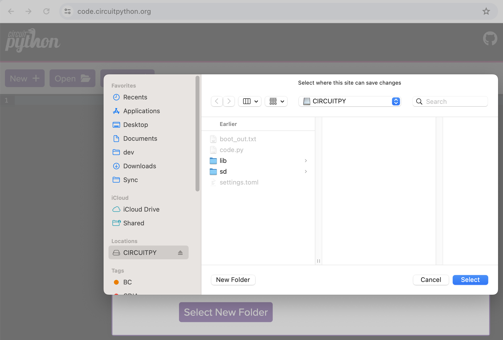
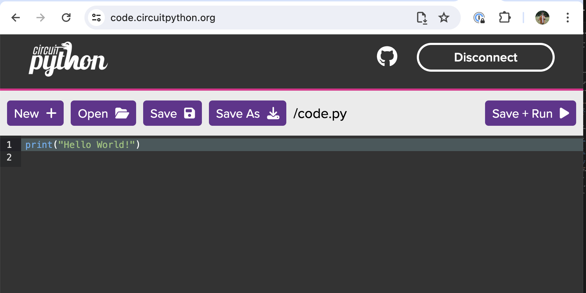
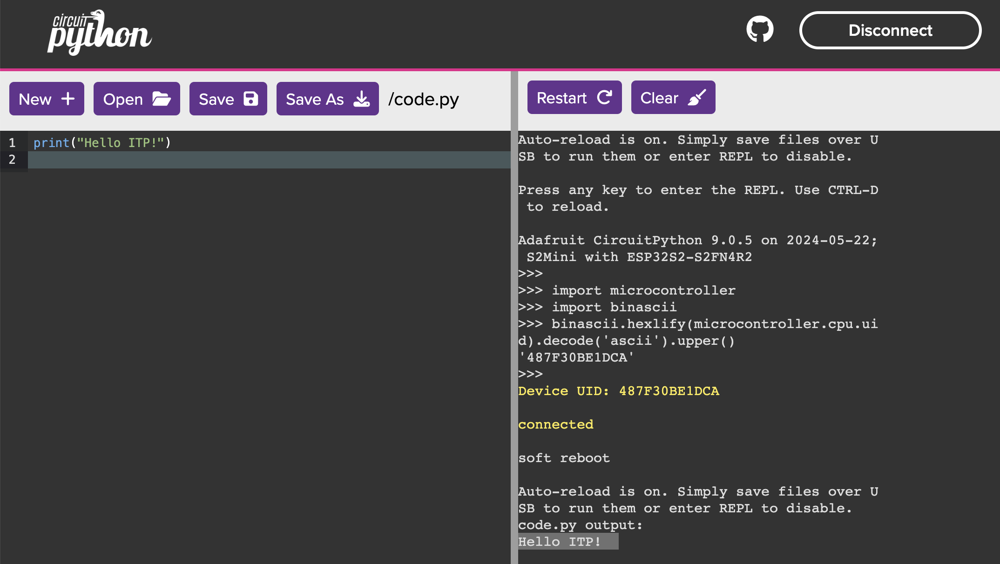
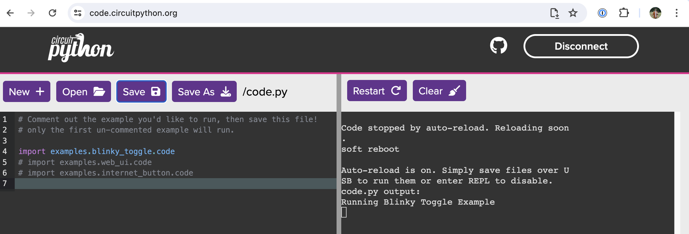
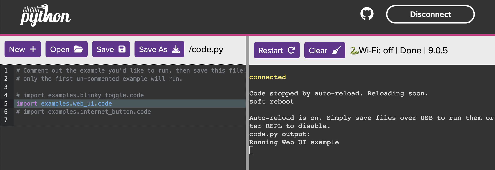
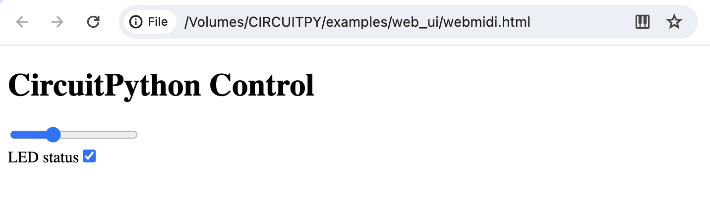

# Gifts workshop ft. CircuitPython & Val Town

## Goals
* Get CircuitPython installed on WiFi enabled microcontroller board.
* Explore/modify example CircuitPython apps
* Set up Val Town account and create a "val" (function) that can be accessed by a standard HTTPS web call
* Communicate between CircuitPython and Val Town apps

## Things You'll Need
1. LOLIN S2 Mini development board (see below)
1. Computer with Google Chrome installed
1. USB cable to connect development board and computer

## Hardware Introduction

#### LOLIN S2 Mini
An [ESP32-S2](https://www.espressif.com/en/products/socs/esp32-s2) WiFi development board


Available on [Amazon](https://www.amazon.com/s?k=s2+mini)
and (even cheaper) on [AliExpress](https://www.aliexpress.us/w/wholesale-s2-mini.html?spm=a2g0o.home.search.0).

### Features
* Reset button (labeled `RST`, top right)
    * Restarts the code running on the ESP32
* "Boot" button (labeled `0`, top-left)
    * When held while reset is pressed/released, this will put the ESP32 into bootloader mode, which allows new code to be "flashed" to it from the computer.
    * **You can use this button to perform actions in your code!** It is attached to ESP32 pin 0.
* LED (white rectangle between boot button and USB port)
    * You can turn it on off from your code. It is attached to ESP32 pin 15.
* GPIO pins (32 silver lined holes on either side)
    * Can be used to hook up external components (sensors, displays, etc)
    * We won't be using these in this workshop

## Installing CircuitPython
1. **In Google Chrome** (other browsers don't work yet), navigate to the [CircuitPython installer page for for LOLIN S2 Mini](https://circuitpython.org/board/lolin_s2_mini/)


2. Plug your S2 Mini into your computer using its USB-C port.
2. After it is plugged in, **hold the boot button (`0`) and -while holding- press and release the reset button (`RST`).** Release the boot button.
2. On the CircuitPython web page, click the `Open Installer` button.


5. Click `Full CircuitPython 9.X.X Install`
5. Click `Next` then `Connect`


7. Select your ESP32-S2 device from Chrome's drop down menu and click `Connect`.
7. When you are asked to "overwrite everything" on the device, click `Continue`.
7. Installation will begin:


10. When flashing is done, hit the reset (`RST`) button.
10. Click `Select S2MINIBOOT Drive`, and find the the drive named `S2MINIBOOT` that should now be mounted to your computer. **DO NOT SELECT ANY OTHER DRIVE - IF YOU ARE UNSURE, BAIL!**
10. If prompted, allow the site to `Edit Files`


13. Observe that the `S2MINIBOOT` drive has been unmounted, and a new drive named `CIRCUITPY` has appeared (may take a minute, hit the reset button if it doesn't show).
13. **At this point, CircuitPython is installed and the rest of the Installer steps are optional. We're going to skip them for this workshop.**

## Using CircuitPython

### To update your CircuitPython application, all you need to do is modify the `code.py` file on the `CIRCUITPY` drive and save it. When saved, the app will restart and your new code will be executed.

You can use any code editor to modify the files on `CIRCUITPY` but in this tutorial, we'll use the web editor since it does not require any installation and has a built in terminal so we can see our logs in real time.

1. With your dev board still connected, avigate to [code.circuitpython.org](https://code.circuitpython.org/)
1. Select `USB` (this is how the web page communicates with the dev board).


3. Click `Connect to Device` and select your ESP32-S2 from Chrome's dropdown menu.
3. Click `Select New Folder` and select the root directory of your `CIRCUITPY` drive. **DO NOT SELECT ANY OTHER DRIVE/FOLDER**


5. Click `Open` and select the file `code.py`. The file will open in the embedded editor.


6. Click on the `Serial` tab at the bottom of the page, observe that a terminal opens on the right side of the page. this is where our logs will show up! Some text may already be there.
6. Edit the print statement in `code.py` to say something else, like:
```print("Hello ITP")```
6. Click `Save`. Observe that the app restarts (the LED will flash a few times), and look for your updated log message in the terminal. **Congrats, you're a CircuitPython developer!**


## Loading CircuitPython Examples

1. Download this repository from GitHub. You can use git if you're comfortable, but otherwise:
    * Scroll to the top of this page.
    * Click `Code`
    * Select `Download Zip` (file will download)
    * Extract contents of the zip file to your desktop/documents
1. Copy all files (except for the `.docs` folder) to the root directory of your `CIRCUITPY` Drive. Overwrite all files/directories. 
1. **RESET YOUR DEVICE by tapping the reset (`RST`) button**.
1. Using your editor of choice (or [code.circuitpython.org](https://code.circuitpython.org/) as discussed in previous step), open up the updated `code.py` file. 


4. The "Blinky Toggle" example will be loaded by default. Use the boot button (`0`) to turn the LED on and off.
5. If you want to view/edit the "Blinky Toggle" code, open the file: `examples/blinky_toggle/code.py` from your `CIRCUITPY` drive.

6. Next let's try the "Web UI" example, which lets us control/view data from our device from a web page. In the _root_ level `code.py` file, comment out the ```import examples.blinky_toggle.code``` line, and _uncomment_ the ```# import examples.web_ui.code``` line.


8. In your computer's file explorer, find the file `CIRCUITPY/examples/webui/webmidi.html` and open it in Chrome.
8. Chrome will ask if you want to "Control ... MIDI devices" - click `Allow`.
8. Use the on-screen slider and checkbox to toggle the status and adjust the brightness of the device's LED. You can also use the boot button (`0`) to toggle the LED on and off. The web page should update to reflect the new status.


11. If you want to view/edit the "Web UI" code, open the file: `examples/web_ui/code.py` from your `CIRCUITPY` drive. You can also modifiy the `webmidi.html` file!